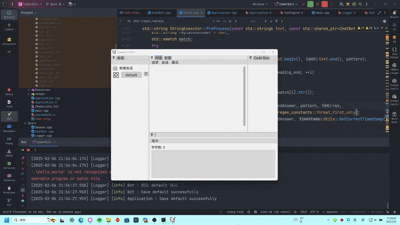

<p align="center">
    
</p>

<div align="center">

# 🤖 ChatBot - Multi-functional AI Assistant Framework

[English](README_EN.md) | [中文](README.md)

_✨ All-in-one AI interaction solution: Voice wake-up, multimodal dialogue, local execution, cross-platform support ✨_

</div>

<p align="center">
  
  <a href="https://raw.githubusercontent.com/NGLSG/ChatBot/main/LICENSE">
    
  </a>
  
  
</p>

## ✨ Key Features

<table>
  <tr>
    <td>
      <h3>🧠 Local Large Models</h3>
      <p>Supports running local large models directly without additional software, reducing hardware requirements and ensuring privacy</p>
    </td>
    <td>
      <h3>🔮 Multi-API Support</h3>
      <p>Supports OpenAI, Claude, iFlytek Spark, Huoshan AI, Tongyi Qianwen, Tencent Hunyuan, Baichuan AI, Gemini, and more</p>
    </td>
  </tr>
  <tr>
    <td>
      <h3>🐳 Ollama Integration</h3>
      <p>Seamless integration with Ollama, supporting OpenAI-compatible network APIs for flexible model invocation</p>
    </td>
    <td>
      <h3>🎨 AI Art Creation</h3>
      <p>Integrated Stable Diffusion for generating high-quality AI images, unleashing creative potential</p>
    </td>
  </tr>
  <tr>
    <td>
      <h3>🔊 Voice Interaction</h3>
      <p>Supports voice wake-up and real-time conversation for natural and smooth human-machine interaction</p>
    </td>
    <td>
      <h3>📊 Math Processing</h3>
      <p>Powerful mathematical computation capabilities for handling complex calculations and scientific analysis</p>
    </td>
  </tr>
  <tr>
    <td>
      <h3>🧩 Extensible Scripts</h3>
      <p>Customize functionality through Lua scripts for flexible expansion and personalized needs</p>
    </td>
    <td>
      <h3>👩‍💻 Code Assistant</h3>
      <p>Supports code project creation and code completion, serving as a developer's powerful tool</p>
    </td>
  </tr>
  <tr>
    <td>
      <h3>💻 Local Execution</h3>
      <p>Supports local command execution for safer and more efficient task completion</p>
    </td>
    <td>
      <h3>👾 Live2D Models</h3>
      <p>Supports Live2D model display, creating vivid and engaging visual interaction experiences</p>
    </td>
  </tr>
</table>

## 📝 System Demo



## 🛠️ Environment Setup

### Dependencies

ChatBot requires the following dependencies:

- nlohmann-json: Modern C++ JSON library
- cpr: Simplified HTTP request library for C++
- PortAudio: Cross-platform audio I/O library
- OpenGL: Graphics rendering library
- imgui: Lightweight GUI library
- glfw3: Window and OpenGL context creation
- yaml-cpp: YAML parsing library
- sol2: Lua C++ API wrapper
- Lua: Lightweight scripting language
- Stb: Single-file library collection
- SDL2/SDL2_image: Multimedia library
- glad: OpenGL loader library
- OpenSSL: Secure communication library

### Installing Dependencies with vcpkg

#### VCPKG Installation

<details>
<summary>Windows</summary>

```bash
git clone https://github.com/Microsoft/vcpkg.git
cd vcpkg
./bootstrap-vcpkg.bat
```

</details>

<details>
<summary>Linux</summary>

```bash
git clone https://github.com/Microsoft/vcpkg.git
cd vcpkg
./bootstrap-vcpkg.sh
```

</details>

#### Installing Dependencies

```bash
vcpkg install nlohmann-json cpr PortAudio OpenGL imgui glfw3 yaml-cpp sol2 Lua Stb SDL2 SDL2_image glad OpenSSL
vcpkg integrate install
```

## 🚀 Compilation Guide

```bash
cd ChatBot
mkdir build
cd build
cmake -B build/ -S . -DCMAKE_TOOLCHAIN_FILE=path/to/vcpkg.cmake
cd build
cmake --build .
```

## 💡 Usage Tips

1. On first launch, configure your API keys or local model paths in the configuration file
2. Extend functionality by customizing Lua scripts
3. Place Live2D models in the `models/Live2D/` folder to load them
4. Local large models can be launched directly without additional dependencies
5. Supports third-party API services compatible with OpenAI interfaces

## 🌐 API Support

This project supports the following API types:

- **Public API Services**
    - OpenAI (GPT series)
    - Claude (Anthropic)
    - Google Gemini
    - iFlytek Spark
    - Huoshan AI
    - Tongyi Qianwen
    - Tencent Hunyuan
    - Baichuan AI
    - OpenAI-compatible API services

- **Local Models**
    - Ollama (supports various open-source models)
    - LLama (various local models)

## 🔗 Related Links

- [Project Documentation](https://github.com/NGLSG/ChatBot/wiki)
- [Issue Tracker](https://github.com/NGLSG/ChatBot/issues)
- [Changelog](https://github.com/NGLSG/ChatBot/blob/main/CHANGELOG.md)

## 📊 Development Roadmap

- [ ] Multi-language interface support
- [ ] Mobile adaptation
- [ ] Plugin marketplace
- [ ] More API support

## ⭐ Supporting the Project

If you like this project, please give us a star! Your support motivates us to keep improving.

## 📄 License

This project is licensed under the [GNU General Public License v3.0](LICENSE) (GPL-3.0). This means you are free to use,
modify, and distribute the software, but any derivative works must also be released under the same license.