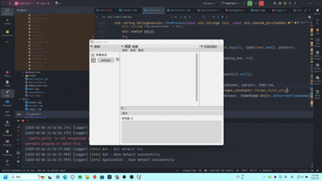

<p align="center">
    
</p>

<div align="center">

# 🤖 ChatBot - 多功能AI助手框架

[English](README_EN.md) | [中文](README.md)

_✨ 一站式AI交互解决方案：语音唤醒、多模态对话、本地执行、跨平台支持 ✨_

</div>

<p align="center">
  
  <a href="https://raw.githubusercontent.com/NGLSG/ChatBot/main/LICENSE">
    
  </a>
  
  
</p>

## ✨ 功能亮点

<table>
  <tr>
    <td>
      <h3>🧠 本地大模型</h3>
      <p>支持直接运行本地大模型，无需安装其他软件，降低硬件要求，保护隐私安全</p>
    </td>
    <td>
      <h3>🔮 多API支持</h3>
      <p>支持OpenAI、Claude、讯飞星火、火山引擎、通义千问、腾讯混元、百川AI、Gemini等多种API</p>
    </td>
  </tr>
  <tr>
    <td>
      <h3>🐳 Ollama集成</h3>
      <p>无缝集成Ollama，支持泛OpenAI接口的网络API，实现灵活模型调用</p>
    </td>
    <td>
      <h3>🎨 AI艺术创作</h3>
      <p>集成Stable Diffusion，轻松生成高质量AI图像，释放创意潜能</p>
    </td>
  </tr>
  <tr>
    <td>
      <h3>🔊 语音交互</h3>
      <p>支持语音唤醒与实时对话，自然流畅的人机交互体验</p>
    </td>
    <td>
      <h3>📊 数学处理</h3>
      <p>强大的数学运算能力，轻松处理复杂计算和科学分析</p>
    </td>
  </tr>
  <tr>
    <td>
      <h3>🧩 可扩展脚本</h3>
      <p>通过Lua脚本定制功能，灵活扩展，满足个性化需求</p>
    </td>
    <td>
      <h3>👩‍💻 代码助手</h3>
      <p>支持代码项目创建与代码补全，成为开发者得力助手</p>
    </td>
  </tr>
  <tr>
    <td>
      <h3>💻 本地执行</h3>
      <p>支持本地命令执行，更安全、更高效地完成任务</p>
    </td>
    <td>
      <h3>👾 Live2D模型</h3>
      <p>支持Live2D模型展示，创造生动有趣的视觉交互体验</p>
    </td>
  </tr>
</table>

## 📝 系统演示



## 🛠️ 环境配置

### 依赖项

ChatBot需要以下依赖项：

- nlohmann-json：现代C++的JSON处理库
- cpr：简化HTTP请求的C++库
- PortAudio：跨平台音频I/O库
- OpenGL：图形渲染库
- imgui：轻量级GUI库
- glfw3：创建窗口与OpenGL上下文
- yaml-cpp：YAML解析库
- sol2：Lua C++ API封装库
- Lua：轻量级脚本语言
- Stb：单文件库集合
- SDL2/SDL2_image：多媒体库
- glad：OpenGL加载库
- OpenSSL：安全通信库

### 使用vcpkg安装依赖

#### VCPKG 安装

<details>
<summary>Windows</summary>

```bash
git clone https://github.com/Microsoft/vcpkg.git
cd vcpkg
./bootstrap-vcpkg.bat
```
</details>

<details>
<summary>Linux</summary>

```bash
git clone https://github.com/Microsoft/vcpkg.git
cd vcpkg
./bootstrap-vcpkg.sh
```
</details>

#### 安装依赖项

```bash
vcpkg install nlohmann-json cpr PortAudio OpenGL imgui glfw3 yaml-cpp sol2 Lua Stb SDL2 SDL2_image glad OpenSSL
vcpkg integrate install
```

## 🚀 编译指南

```bash
cd ChatBot
mkdir build
cd build
cmake -B build/ -S . -DCMAKE_TOOLCHAIN_FILE=path/to/vcpkg.cmake
cd build
cmake --build .
```

## 💡 使用提示

1. 首次启动时，需要在配置文件中设置您的API密钥或者本地模型路径
2. 可通过自定义Lua脚本扩展功能
3. Live2D模型放置于models/Live2D/文件夹中即可加载
4. 本地大模型可直接启动，无需额外安装依赖
5. 支持兼容OpenAI接口的第三方API服务

## 🌐 API支持

本项目支持以下API类型：

- **公共API服务**
    - OpenAI (GPT系列)
    - Claude (Anthropic)
    - Google Gemini
    - 讯飞星火
    - 火山引擎
    - 通义千问
    - 腾讯混元
    - 百川AI
    - 泛OpenAI接口的API服务

- **本地模型**
    - Ollama (支持各种开源模型)
    - LLama (各种本地模型)

## 🔗 相关链接

- [项目文档](https://github.com/NGLSG/ChatBot/wiki)
- [问题反馈](https://github.com/NGLSG/ChatBot/issues)
- [更新日志](https://github.com/NGLSG/ChatBot/blob/main/CHANGELOG.md)

## 📊 开发路线图

- [ ] 多语言界面支持
- [ ] 移动端适配
- [ ] 插件市场
- [ ] 本地大模型性能优化
- [ ] 更多API支持

## ⭐ 支持项目

如果您喜欢这个项目，请给我们点个星！您的支持是我们不断改进的动力。

## 📄 许可证

本项目采用 [GNU通用公共许可证v3.0](LICENSE) (GPL-3.0)。这意味着您可以自由地使用、修改和分发本软件，但任何基于本软件的衍生作品也必须以相同的许可证发布。


